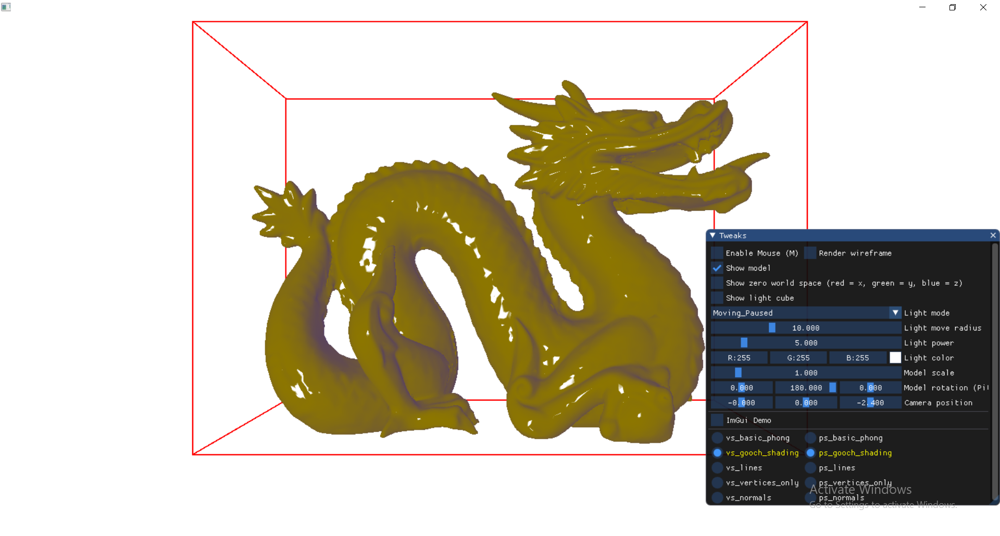

### Sample

 * DirectX 11
 * Drag and drop .OBJ model loading
 * Shaders hot reload/recompile

### Build

vcpkg is used, see build.cmd for a standard CMake invoke.
FetchContent is used to get [ImGui](https://github.com/ocornut/imgui) and [win_io](https://github.com/grishavanika/win_io) deps.
