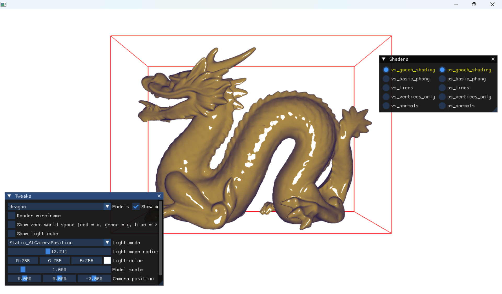

### Run

```
# Convert raw .obj into "simple" internal format.
lr_export.exe assets\skull\skull.obj assets\_package
# Load assets\_package\skull.lr.bin model.
```

### Sample



### Build

#### Build and configure as fast as possible

```
cmake -G "Visual Studio 16 2019" ^
    -DCMAKE_TOOLCHAIN_FILE=C:\libs\vcpkg\scripts\buildsystems\vcpkg.cmake ^
    -A x64 ..
```

This will pull dependencies from vcpkg installed in C:/libs/vcpkg.  
Otherwise, 

```
cmake -G "Visual Studio 16 2019" -A x64 ..
```

This will pull dependencies from github (if not yet downloaded with get submodules)
and build them as part of building process.

#### Clang on Windows and MinGW.

Clang:
```
cmake -G "Visual Studio 16 2019" -A x64 -T LLVM ..
```

MinGW:
```
cmake -G "MinGW Makefiles" ..
```
